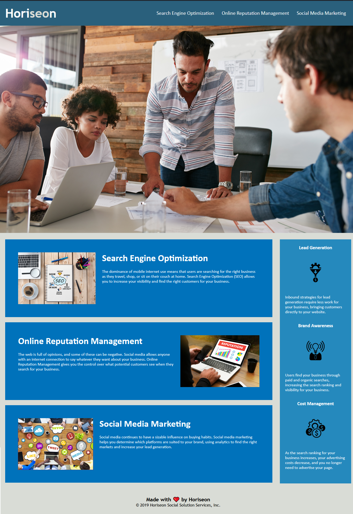

# Description

In this assignment, our task was to improve the accessibility and codebase of the project website by refactoring it.

To do so, I:

    1. Added alt attributes to icons and images so screen readers can better understand the on-page image.
    2. Renamed div elements to semantic elements, such as header, nav, section and footer, for greater clarification.
    3. Consolidated multiple ids into a single class if they used the same CSS declerations to minimize code.
    4. Reordered selectors to be in order of tag, id and class, in alphabetical order in CSS file.
    5. Added a descriptive title to improve search engine optimization

HTML | CSS

# Screenshot

# Link

(https://eriksvetlik.github.io/01-homework/)
